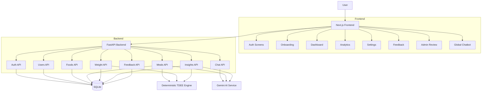
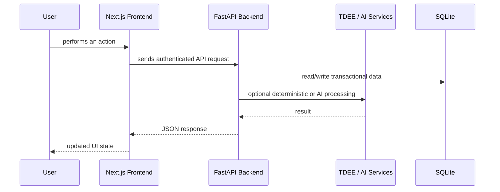

<div align="center">

# Kinetic

**An ML-backed adaptive metabolic engine and nutrition platform.**

<p>
  
  
  
  
  
</p>

</div>

## Overview

Kinetic is a full-stack nutrition tracking application that moves beyond static calorie counting formulas. It acts as a dynamic metabolic engine, combining:

- Context-aware food logging
- Exponentially Weighted Moving Average (EWMA) weight trend analysis
- Adaptive calorie recommendations based on real metabolic flux
- Natural-language meal parsing
- Contextual AI chat
- Admin feedback review

The project is designed as a product system. The core philosophy:
> **Track user behavior, calculate the true physiological state, and adapt calorie targets using deterministic logic rather than static formulas alone.**

---

---

## 🛠️ Tech Stack

- ⚡ **Frontend:** Next.js 15, React, TailwindCSS, TypeScript
- 🚀 **Backend:** FastAPI, Python, Pydantic
- 🗄️ **Database:** SQLite (Migrating to PostgreSQL + Alembic)
- 🧠 **Intelligence:** Google Gemini AI, EWMA Smoothing, OLS Linear Regression

---

## 🌟 Core Features

### Adaptive Engine Capabilities
- **EWMA Smoothing:** Filters out daily scale noise to find the true weight trend.
- **OLS Trend Estimation:** Uses Ordinary Least Squares regression to calculate precise weight velocity.
- **Maintenance Calorie Estimation:** Dynamically back-calculates true TDEE based on intake vs. trend.
- **Confidence Gating & Safety:** Applies calorie floor logic and bounds adjustments to a safe +/-150 kcal range.

### Indian-First Nutrition Tracking
- Native support for katori-based and roti-based logging.
- Seeded Indian food catalog with regional variations.
- Custom oil-level calibration.

### Seamless User Experience
- JWT-based authenticated API access.
- Natural language meal parsing (e.g., "I ate 2 rotis and a bowl of dal").
- Contextual floating AI chat that understands the user's current nutritional state.
- Integrated feedback submission and admin review dashboard.

---

## Full System Architecture

Kinetic is organized into three main layers:

1. **Application Layer**
2. **Intelligence Layer**
3. **Persistence Layer**

### Architecture Map



### Request Lifecycle



---

## Layer-by-Layer Breakdown

### 1. Application Layer

This is the user-facing product experience.

#### Frontend responsibilities
- render login and registration flows
- collect onboarding inputs
- allow food search and meal logging
- show daily calories and macros
- show weight history and adaptive analytics
- submit feedback
- provide admin feedback review
- host the floating AI chat experience

#### Backend responsibilities
- validate and authenticate requests
- expose stable REST APIs
- compute meal-derived nutrition values
- maintain daily nutrition summaries
- store weight trends and insights
- manage feedback lifecycle

### 2. Intelligence Layer

This layer is the core differentiator, separated into deterministic and AI-driven logic.

#### Deterministic Engine (The Math)
This is the analytical source of truth. Standard TDEE formulas (like Mifflin-St Jeor) are static and often inaccurate. Kinetic solves this using data science:
- **EWMA Smoothing:** $S_t = \alpha Y_t + (1 - \alpha) S_{t-1}$ is used to smooth daily weight fluctuations (water retention, sodium, etc.).
- **OLS Regression:** Applies linear regression over the smoothed trend to determine true weight loss/gain velocity.
- **Dynamic Adjustments:** Calculates required calorie adjustments based on the delta between expected weight velocity and actual velocity, gated by statistical confidence.

#### AI Layer (The UX)
This is the UX augmentation layer.
- natural-language meal parsing
- contextual nutrition chat
- plain-English explanation of system outputs

**Important:** AI handles the unstructured data and usability, but the adaptive recommendation logic strictly comes from the deterministic math engine.

### 3. Persistence Layer

This layer stores both raw activity and derived application state.

| Table | Purpose |
|---|---|
| `users` | identity, role, goals, target calories, Indian household multipliers |
| `foods` | normalized food catalog with macro values per 100g |
| `meal_entries` | every logged meal event |
| `daily_summaries` | daily aggregate calories and macros |
| `user_weights` | raw weights and EWMA trend weights |
| `kinetic_insights` | stored adaptive recommendation snapshots |
| `user_feedbacks` | user-to-admin feedback records |

---

## Codebase Layout

```text
apps/
  api/
    app/
      api/
        auth.py
        users.py
        foods.py
        meals.py
        weight.py
        insights.py
        chat.py
        feedback.py
      core/
        config.py
        database.py
        security.py
      models/
        user.py
        food.py
        meal.py
        user_weight.py
        zoro_insight.py
        feedback.py
      schemas/
        user.py
        food_meal.py
        chat.py
        nlp.py
        feedback.py
      services/
        tdee_engine.py
        ai_service.py
      main.py
  web/
    src/
      app/
        (auth)/
        (user)/
        admin/
        onboarding/
      components/
        GlobalChatbot.tsx
      lib/
        api.ts
        auth.ts
```

---

## API Surface

Current FastAPI routes:

```text
GET    /api/v1/openapi.json
GET    /docs
GET    /docs/oauth2-redirect
GET    /redoc
POST   /api/v1/auth/register
POST   /api/v1/auth/login
GET    /api/v1/auth/me
GET    /api/v1/users/me
PUT    /api/v1/users/me
GET    /api/v1/foods/search
GET    /api/v1/foods/
POST   /api/v1/meals/
GET    /api/v1/meals/today
GET    /api/v1/meals/today/entries
GET    /api/v1/meals/history
PUT    /api/v1/meals/{meal_entry_id}
DELETE /api/v1/meals/{meal_entry_id}
POST   /api/v1/meals/parse-text
POST   /api/v1/ai/chat/
POST   /api/v1/weight/
GET    /api/v1/weight/history
GET    /api/v1/insights/latest
POST   /api/v1/insights/apply
POST   /api/v1/feedback/
GET    /api/v1/feedback/mine
GET    /api/v1/feedback/admin
PATCH  /api/v1/feedback/admin/{feedback_id}
GET    /
GET    /health
```

---

## Local Setup

### Start the backend

```bash
cd "E:\Calorie Tracker\apps\api"
venv\Scripts\uvicorn app.main:app --host 0.0.0.0 --port 8000 --reload
```

### Start the frontend

```bash
cd "E:\Calorie Tracker\apps\web"
npm run dev
```

### Open in browser

- Frontend: `http://localhost:3000`
- Backend docs: `http://localhost:8000/docs`

---

## Local Development Notes

- SQLite is still used for local persistence
- the frontend expects `http://localhost:8000/api/v1` by default
- `admin@kinetic.com` is treated as an admin account in local registration to simplify testing
- some older landing/admin screens still need lint cleanup outside the main app flow

---

## Recommended Demo Flow

1. Register a standard user account
2. Complete onboarding
3. Log meals on the dashboard
4. Log daily weights in Analytics
5. Generate and review adaptive insights
6. Submit feedback as a user
7. Register `admin@kinetic.com`
8. Review feedback in `/admin/feedback`

---

## What Is Not Production-Ready Yet

| Area | Current Status |
|---|---|
| Secrets | still hardcoded in backend config |
| Database | still SQLite for local development |
| Migrations | Alembic not added yet |
| Auth hardening | frontend protection is still lightweight |
| AI safety | rate limiting not implemented yet |
| Deployment | containerization and production infra still pending |

---

## Next Steps

### Phase 2: Production Infrastructure

- move secrets into environment variables
- migrate SQLite to PostgreSQL
- introduce Alembic migrations
- harden auth and admin authorization
- add API rate limiting for AI endpoints

### Phase 3: Data Engineering Layer

- add a `data/` workspace
- introduce dbt models for analytics
- build marts for nutrition, adherence, and insights
- add orchestration for scheduled transformations
- prepare ML-ready feature tables

### Phase 4: Product Hardening

- add backend and frontend tests
- improve observability and error handling
- clean remaining frontend lint issues
- containerize the stack
- prepare deployment workflows

---

## Summary

Kinetic is now a real authenticated application with persisted nutrition data, feedback workflows, AI augmentation, and a deterministic adaptive recommendation engine. The next major step is to harden the infrastructure and add a clean data engineering layer on top of the transactional system.
